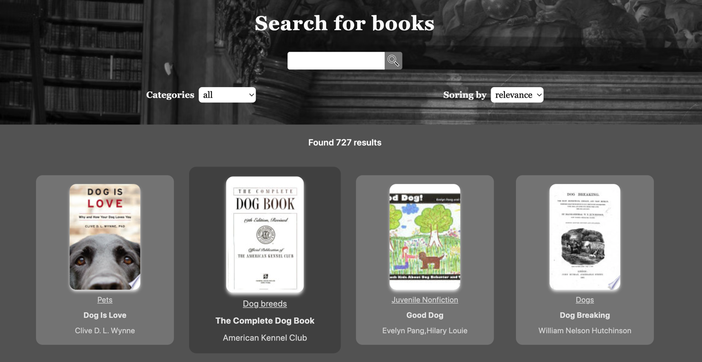

## Search for books

***

***

### Description

<i>Simple SPA to help you find any book!
It includes three inputs and content block!

***

#### `Inputs`

* <b>MainInput</b> ( to fill it with book title );
* <b>CategoriesInput</b> ( to choose category );
* <b>OrderInput</b> ( to choose order of results - relevance or newest );

***

#### `Content`
The main content of SPA includes two options:
* list of books cards which matches your request;
* current book info - extended information about book;

***

### Tech Stack

* [x] HTML;
* [x] TypeScript;
* [x] CSS/SCSS;
* [x] Tailwind CSS;
* [x] React JS;
* [x] Redux Toolkit;
* [x] React Hook Form

***

### Contacts

For feedback:`Gambit47@yandex.ru` 
Deployed:`https://books-search-ten.vercel.app/`

